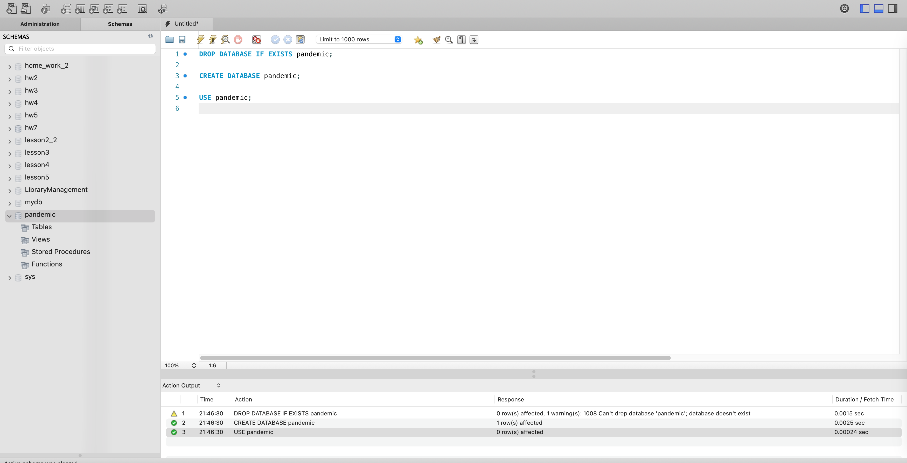
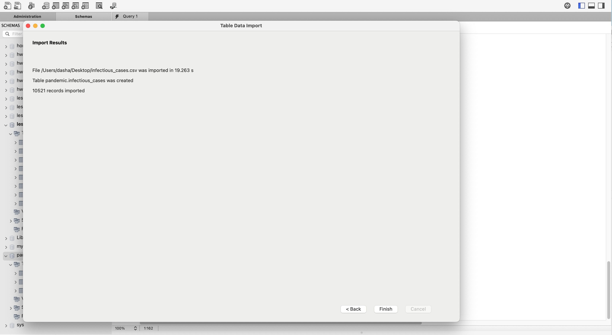
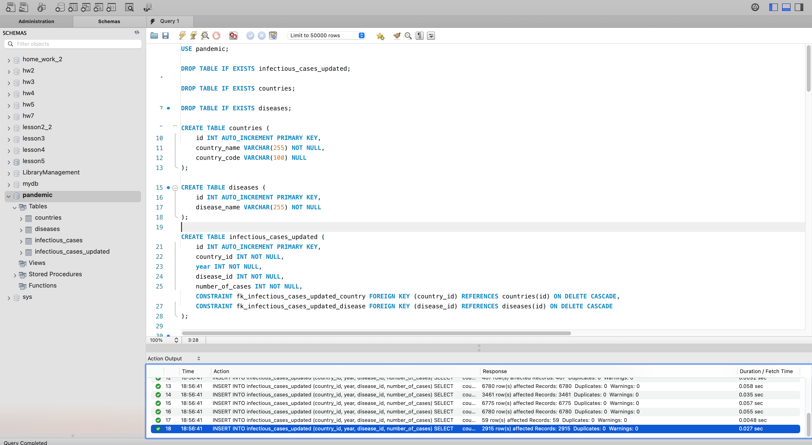
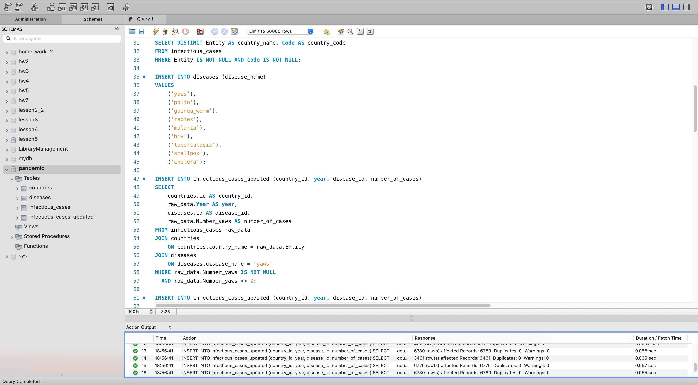
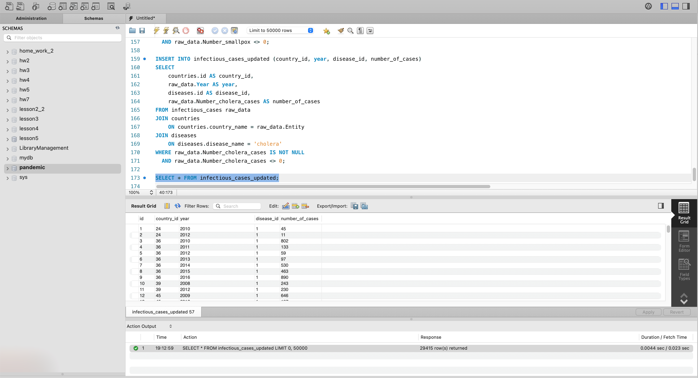
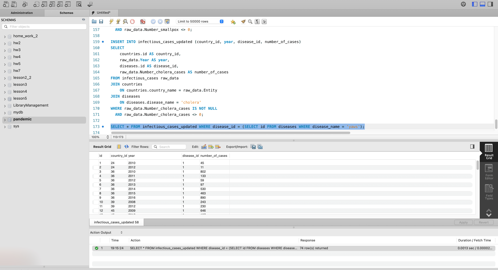
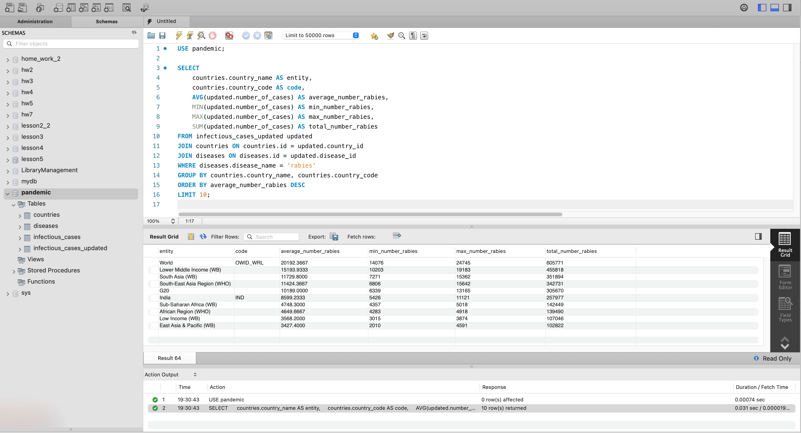
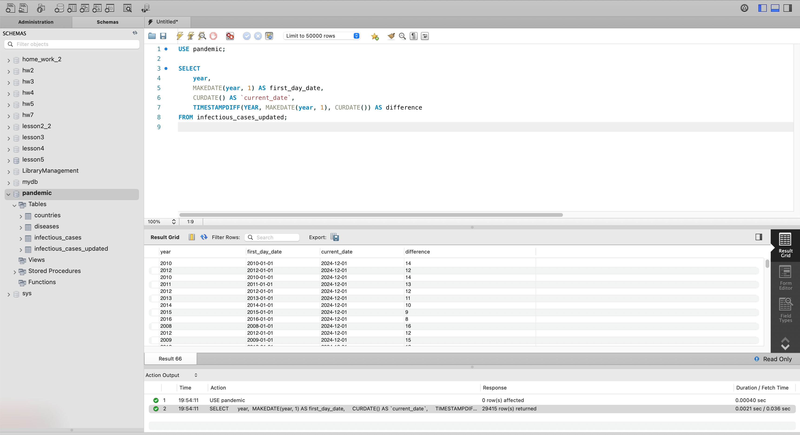

# goit-rdb-fp

## Завантажте дані.

```sql
DROP DATABASE IF EXISTS pandemic;

CREATE DATABASE pandemic;

USE pandemic;
```





## Нормалізуйте таблицю infectious_cases до 3ї нормальної форми.

### Створення таблиць.

- countries для зберігання даних про країни
- diseases для зберігання даних про захворювання
- infectious_cases_updated для зберігання оновлених даних про захворювання по країнах і роках

```sql
USE pandemic;

DROP TABLE IF EXISTS infectious_cases_updated;

DROP TABLE IF EXISTS countries;

DROP TABLE IF EXISTS diseases;

CREATE TABLE countries (
    id INT AUTO_INCREMENT PRIMARY KEY,
    country_name VARCHAR(255) NOT NULL,
    country_code VARCHAR(100) NULL
);

CREATE TABLE diseases (
    id INT AUTO_INCREMENT PRIMARY KEY,
    disease_name VARCHAR(255) NOT NULL
);

CREATE TABLE infectious_cases_updated (
    id INT AUTO_INCREMENT PRIMARY KEY,
    country_id INT NOT NULL,
    year INT NOT NULL,
    disease_id INT NOT NULL,
    number_of_cases INT NOT NULL,
    CONSTRAINT fk_infectious_cases_updated_country FOREIGN KEY (country_id) REFERENCES countries(id) ON DELETE CASCADE,
    CONSTRAINT fk_infectious_cases_updated_disease FOREIGN KEY (disease_id) REFERENCES diseases(id) ON DELETE CASCADE
);
```

### Імпорт даних.

- Імпортовані у таблицю countries унікальні країни та їхні коди.
- Імпортовані у таблицю diseases список захворювань.

```sql
INSERT INTO countries (country_name, country_code)
SELECT DISTINCT Entity AS country_name, Code AS country_code
FROM infectious_cases
WHERE Entity IS NOT NULL AND Code IS NOT NULL;

INSERT INTO diseases (disease_name)
VALUES
    ('yaws'),
    ('polio'),
    ('guinea_worm'),
    ('rabies'),
    ('malaria'),
    ('hiv'),
    ('tuberculosis'),
    ('smallpox'),
    ('cholera');
```

### Вставка даних в таблицю infectious_cases_updated.

```sql
-- Приклад вставки Number_yaws

INSERT INTO infectious_cases_updated (country_id, year, disease_id, number_of_cases)
SELECT
    countries.id AS country_id,
    raw_data.Year AS year,
    diseases.id AS disease_id,
    raw_data.Number_yaws AS number_of_cases
FROM infectious_cases raw_data
JOIN countries
    ON countries.country_name = raw_data.Entity
JOIN diseases
    ON diseases.disease_name = 'yaws'
WHERE raw_data.Number_yaws IS NOT NULL
  AND raw_data.Number_yaws <> 0;
```





### Перевірка.





## Проаналізуйте дані.

```sql
USE pandemic;

SELECT
    countries.country_name AS entity,
    countries.country_code AS code,
    AVG(updated.number_of_cases) AS average_number_rabies,
    MIN(updated.number_of_cases) AS min_number_rabies,
    MAX(updated.number_of_cases) AS max_number_rabies,
    SUM(updated.number_of_cases) AS total_number_rabies
FROM infectious_cases_updated updated
JOIN countries ON countries.id = updated.country_id
JOIN diseases ON diseases.id = updated.disease_id
WHERE diseases.disease_name = 'rabies'
GROUP BY countries.country_name, countries.country_code
ORDER BY average_number_rabies DESC
LIMIT 10;
```



## Побудуйте колонку різниці в роках.

```sql
USE pandemic;

SELECT
    year,
	MAKEDATE(year, 1) AS first_day_date,
    CURDATE() AS `current_date`,
    TIMESTAMPDIFF(YEAR, MAKEDATE(year, 1), CURDATE()) AS difference
FROM infectious_cases_updated;
```


